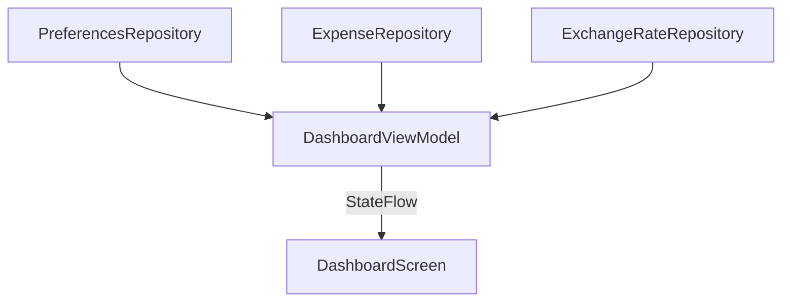
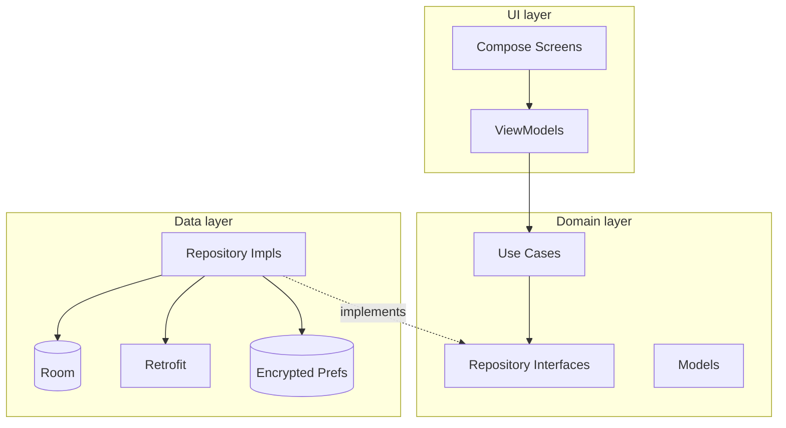
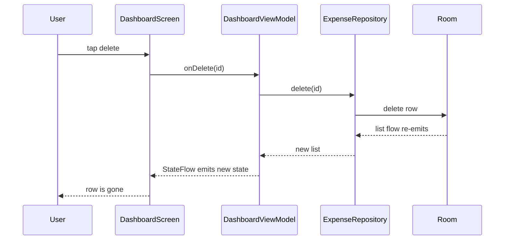
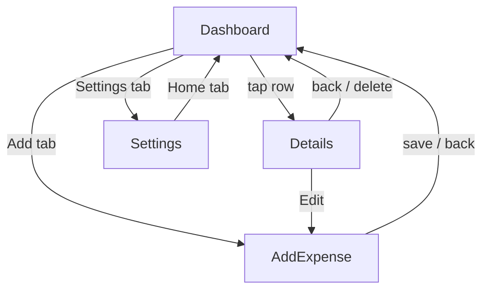
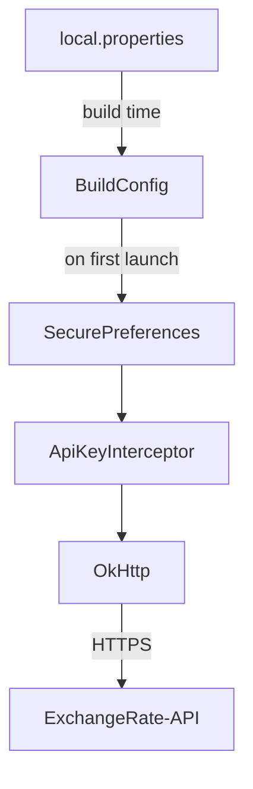

# SpendSmart

A multi-currency expense tracker for Android. Log what you spend in whatever currency you actually paid in, see a per-month total converted to your chosen display currency, and get a category breakdown — all offline-first, with live exchange rates fetched from ExchangeRate-API when an internet connection is available.

Built end-to-end with Kotlin and Jetpack Compose, following Google's recommended app architecture (MVVM + Clean Architecture with a strict UI / Domain / Data layer split).

---

## What the app does

The app has three primary destinations reachable from the bottom navigation:

- **Home (Dashboard)**
  - Greets you with the current month label.
  - Floating summary card: this month's total *converted to your display currency*, transaction count, and the top spending category.
  - Donut chart breaking spending down by category, with a colour-coded legend.
  - Recent transactions list. Each row shows the amount in the currency the expense was originally paid in (e.g. `€12.50`), the category emoji, and a delete button that asks for confirmation.
  - Tapping a row opens the Details screen.

- **Add (Add Expense)**
  - Amount field with a currency chip on the left. Tap the chip to pick any of the 10 supported currencies. New expenses default to your display currency; previously-edited expenses keep their original currency.
  - 4-column emoji category grid (Food, Transport, Shopping, Entertainment, Health, Housing, Other).
  - Material 3 date picker.
  - Notes field with a 200-character counter.
  - Gradient submit button with a "Saved" confirmation state.
  - The same screen handles editing via a route argument — tapping Edit on the Details screen reopens this form pre-filled.

- **Settings**
  - Two stat tiles: total transaction count and total spent (in display currency).
  - Theme toggle: System / Light / Dark (segmented buttons).
  - Display-currency picker (modal bottom sheet) — choosing here re-renders every total across the app.
  - About card with the current app version.

A fourth destination, **Expense Details**, opens from the Dashboard. It shows the expense in its original currency in large type, plus a small `≈ $13.40` converted hint below when the currency differs from the display default. Has Edit and Delete actions.

---

## How currency conversion works

Each expense persists the currency it was paid in. The Dashboard's monthly total and donut breakdown are computed by converting every current-month expense into the user's chosen display currency on the fly:

1. On launch (and whenever the user changes the display currency in Settings), `DashboardViewModel` calls `GetExchangeRatesUseCase` with `base = displayCurrency`.
2. The result (`Result<ExchangeRates>`) is cached in a `MutableStateFlow` and combined with the expense list flow.
3. For each expense, `amount / rates[fromCurrency]` yields the value in the display currency. If `fromCurrency == displayCurrency`, the amount is used as-is.
4. If the rates fetch fails or any expense's source currency isn't in the rate table, the state emits `ratesAvailable = false`. The UI then renders `—` for the monthly total with a hint about connectivity, and hides the donut chart. Recent transactions still render normally in their original currency.

Three flows feed the Dashboard's UI state via `combine`. Changing the display currency triggers a fresh rates fetch; changing any expense in Room re-emits the list; the rebuilt state is pushed into a `StateFlow` the screen observes:



The conversion formula relies on the contract that rates are *always* fetched with `base = displayCurrency` — so `rates.rates[fromCurrency]` answers "how many units of `from` equal one unit of the display currency," and dividing the expense amount by that rate produces the converted value.

The standalone Currency Converter screen from earlier iterations was removed — exchange-rate fetching is now an internal service that powers the Dashboard and the Details hint rather than a user-facing tool.

---

## Architecture

Clean Architecture with three layers, wired together by Hilt. The UI layer talks to the Domain layer (interfaces and use cases), and the Data layer implements those interfaces — so dependencies always point inward toward Domain.



- **UI layer** holds Compose screens, ViewModels (one per screen), and immutable `*UiState` data classes. ViewModels only depend on use cases and `PreferencesRepository`.
- **Domain layer** is pure Kotlin — no Android dependencies. It defines `Expense`, `Currency`, `ExpenseCategory`, `ExchangeRates`, `ThemeMode`; the three repository interfaces; the use-case wrappers; and `InputValidator` for regex-based sanitization.
- **Data layer** contains the Room entity / DAO / database, the Retrofit interface + DTO + `ApiKeyInterceptor`, `SecurePreferences` (wraps `EncryptedSharedPreferences`), the three repository implementations, and mappers in both directions.
- **DI modules** (`di/`) bind the layers: `DatabaseModule`, `NetworkModule`, `RepositoryModule`.

### Runtime data flow

State is unidirectional: user actions travel *up* as function calls, state changes flow *down* through a `StateFlow`. Here's what happens when a user deletes an expense from the Dashboard:



No manual UI refresh, no event bus — Room's `Flow`-backed query is the single source of truth, and the `combine` pipeline in the ViewModel turns any upstream change into a fresh UI state automatically.

### Navigation

Navigation is single-Activity Compose Navigation, hosted by `SpendSmartNavHost`. The bottom bar appears on Home and Settings, and is hidden on Add and Details so those feel like full-screen flows.



`AddExpense` is reached two ways: from the bottom-nav Add tab (new expense, currency defaults to the user's display currency), and from the Details screen's Edit button (which passes the existing expense's id as a query argument; the ViewModel detects it and pre-fills every field).

---

## Tech stack

| Concern              | Choice                                                                     |
|----------------------|----------------------------------------------------------------------------|
| Language             | Kotlin 2.3.21                                                              |
| UI                   | Jetpack Compose (Compose BOM 2026.02.01), Material 3                       |
| Theme                | Custom violet palette + per-app dark/light, gradient brush for headers     |
| Navigation           | Navigation Compose 2.8.4                                                   |
| Architecture         | MVVM + Clean Architecture                                                  |
| Dependency injection | Dagger Hilt 2.59.2 (with `hilt-navigation-compose`)                        |
| Local storage        | Room 2.8.4 (KSP-generated DAOs, `Flow`-backed queries)                     |
| Network              | Retrofit 2.11.0, OkHttp 4.12.0 with logging interceptor, Moshi 1.15.1 codegen |
| Secure storage       | AndroidX Security Crypto 1.1.0-α06 (`EncryptedSharedPreferences`)          |
| Concurrency          | Kotlin Coroutines 1.9.0, `Flow` + `StateFlow`                              |
| Charts               | Custom `Canvas`-drawn donut chart (no extra dependencies)                  |
| Build                | AGP 9.2.1, Gradle 9.4.1, KSP 2.3.8                                         |
| Testing              | JUnit4, MockK 1.13.13, kotlinx-coroutines-test, Turbine 1.1.0              |
| Min / Target SDK     | 33 / 36                                                                    |

---

## API integration

The app uses [ExchangeRate-API](https://www.exchangerate-api.com/) (free tier) to fetch live conversion rates.

- **Endpoint:** `GET https://v6.exchangerate-api.com/v6/{API_KEY}/latest/{BASE_CURRENCY}`
- **Auth:** the key is injected as the first path segment by `ApiKeyInterceptor`. The Retrofit interface declares the URL with a literal `__APIKEY__` placeholder; the interceptor rewrites it at request time.
- **Response handling:** the `result` field is checked for `"success"`; otherwise the call surfaces as `Result.failure`. Unknown currency codes in the response are filtered out silently.
- **Key storage:** the key is read from `local.properties` at build time (exposed as `BuildConfig.EXCHANGE_RATE_API_KEY`) and copied into `EncryptedSharedPreferences` on app start. Rebuilding with a new key in `local.properties` transparently rotates the stored value. There is no user-facing UI to set or view the key.

The full lifecycle of the key from source file to outbound request:



If the key is missing or the request fails, the interceptor throws `MissingApiKeyException`, the repository returns `Result.failure`, and the Dashboard degrades gracefully (see "How currency conversion works" above) — the rest of the app keeps working.

---

## Setup

1. Open the project in Android Studio (Giraffe or newer recommended).
2. Get a free API key from <https://www.exchangerate-api.com/>.
3. Add it to `local.properties` at the repo root:
   ```
   EXCHANGE_RATE_API_KEY=your_key_here
   ```
   `local.properties` is gitignored, so the key stays out of source control.
4. Sync Gradle and run the `app` configuration on an emulator or device (minSdk 33).

On first launch the app seeds the Room database with 10 sample USD expenses so the Dashboard isn't empty.

---

## Project layout

```
com.example.spendsmart
│
├── SpendSmartApplication.kt        @HiltAndroidApp
├── MainActivity.kt                 @AndroidEntryPoint, hosts Compose nav
│
├── di/
│   ├── DatabaseModule.kt           Room database + DAO providers
│   ├── NetworkModule.kt            OkHttp, Retrofit, Moshi, API interface
│   └── RepositoryModule.kt         @Binds for the three repositories
│
├── data/
│   ├── local/                      ExpenseEntity, ExpenseDao, SpendSmartDatabase
│   ├── remote/                     ExchangeRateApi, ExchangeRateResponseDto, ApiKeyInterceptor
│   ├── prefs/                      SecurePreferences (EncryptedSharedPreferences wrapper)
│   ├── repository/                 ExpenseRepositoryImpl, ExchangeRateRepositoryImpl, PreferencesRepositoryImpl
│   └── mapper/                     Entity ↔ domain and DTO ↔ domain mappers
│
├── domain/
│   ├── model/                      Expense, ExpenseCategory, Currency, ExchangeRates, ThemeMode
│   ├── repository/                 Interfaces only
│   ├── usecase/                    Observe / Get / Upsert / Delete / Seed / GetExchangeRates / ConvertCurrency
│   ├── util/                       InputValidator (regex sanitization)
│   └── sample/                     SampleExpenses (first-run seed data)
│
└── ui/
    ├── RootViewModel.kt            Exposes themeMode for MainActivity
    ├── navigation/                 Route sealed class + SpendSmartNavHost
    ├── theme/                      Color, Type, Shape, Theme (violet palette, gradient brush)
    ├── components/                 GradientHeader, BottomNavBar, ExpenseListItem, CategoryGrid,
    │                               DonutChart, CurrencyRow, SectionCard, GradientButton
    ├── util/                       Formatters (money, date, month)
    └── screens/
        ├── dashboard/              Screen + ViewModel + UiState
        ├── addexpense/             Screen + ViewModel + UiState (handles both new and edit)
        ├── details/                Screen + ViewModel + UiState
        └── settings/               Screen + ViewModel + UiState
```

---

## Security & data handling

- **HTTPS only.** The network security config (`res/xml/network_security_config.xml`) disables cleartext traffic. ExchangeRate-API only serves TLS so this is enforced end-to-end.
- **Encrypted preferences.** Theme, display currency, and API key live in `EncryptedSharedPreferences` (AES-256-SIV for keys, AES-256-GCM for values) backed by a hardware-backed `MasterKey` when available.
- **Parameterised queries.** All DB access goes through Room's generated DAOs — no raw SQL strings, no concatenation, no SQL injection surface.
- **Input sanitization.** `domain.util.InputValidator` validates amounts with a regex (`^\d{1,9}(\.\d{0,2})?$`, positive only) and strips control characters / collapses whitespace from notes before persisting. The maximum notes length is enforced at 200 characters.
- **No PII.** The app sends only the base currency code to ExchangeRate-API. No user identifiers, no location, no expense data leaves the device.

---

## Testing

JUnit4 + MockK + kotlinx-coroutines-test + Turbine. Five test suites covering 24 unit tests:

- `InputValidatorTest` — amount regex (valid / invalid / boundary cases including SQL-injection-shaped strings), notes sanitization (control-char stripping, whitespace collapsing, 200-char cap), category name validation.
- `ExpenseRepositoryImplTest` — entity ↔ domain mapping over a mocked `ExpenseDao`, upsert forwarding, seed-when-empty behaviour.
- `ExchangeRateRepositoryImplTest` — success path, API error string, and network exception all map to the expected `Result`. Unknown currency codes are filtered out.
- `AddExpenseViewModelTest` — invalid input surfaces field errors and skips persistence; valid submit upserts an `Expense` with the selected currency and sanitized notes; new expenses default to the user's display currency; edit mode prefills all fields including currency.
- `DashboardViewModelTest` — converts multi-currency expenses into the display currency, falls back to `null` total + empty breakdown when rates fail, and the same fallback when an expense's currency is missing from the rate table.

Run with:
```
./gradlew test
```

Lint and full build:
```
./gradlew lintDebug
./gradlew assembleDebug
```

---

## Requirements satisfied

This project was scoped against an Android assignment with the following checklist.

**Core requirements**

- Kotlin only — no Java sources in `app/src/main`.
- 100% Jetpack Compose UI (no `View`-based screens).
- Multiple screens: Dashboard, Add Expense, Expense Details, Settings.
- Jetpack Navigation Compose for transitions.
- MVVM + Clean Architecture with explicit UI / Domain / Data separation.
- Online API integration via Retrofit (ExchangeRate-API).

**Bonus points**

- **Database** — Room (SQLite abstraction) for local expense persistence.
- **Input sanitization** — regex validation in `InputValidator` plus Room's parameterized queries.
- **Encrypted communication** — HTTPS/TLS for all network traffic, `EncryptedSharedPreferences` for sensitive preferences including the API key.
- **Settings screen** — theme toggle (System / Light / Dark) and display-currency picker, plus stats and an About card.
- **Unit testing** — five suites (24 tests) covering validator, repositories, and ViewModels.
- **Clean code** — Clean Architecture layering, Dagger Hilt for DI, single-responsibility ViewModels, immutable UI state, modular packaging by feature and layer.
